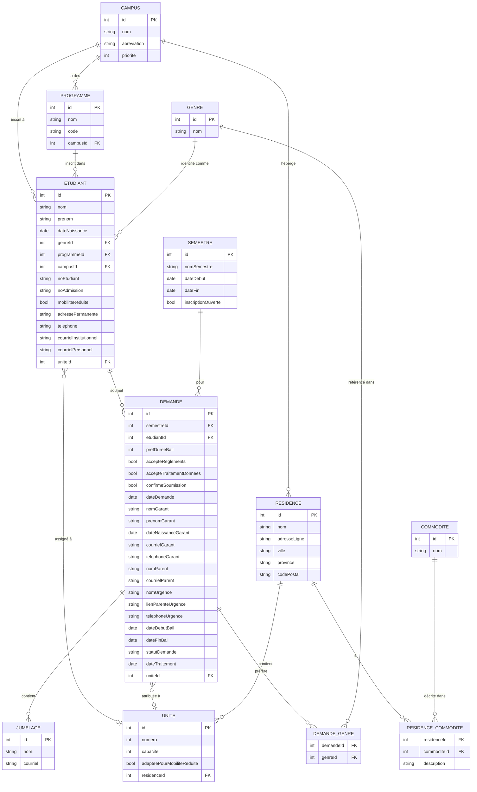

Here's the raw mermaid code:

```mermaid
erDiagram
CAMPUS {
  int id PK
  string nom
  string abreviation
  int priorite
}
PROGRAMME {
  int id PK
  string nom
  string code
  int campusId FK
}
GENRE {
  int id PK
  string nom
}
ETUDIANT {
  int id PK
  string nom
  string prenom
  date dateNaissance
  int genreId FK
  int programmeId FK
  int campusId FK
  string noEtudiant
  string noAdmission
  bool mobiliteReduite
  string adressePermanente
  string telephone
  string courrielInstitutionnel
  string courrielPersonnel
  int uniteId FK
}
SEMESTRE {
  int id PK
  string nomSemestre
  date dateDebut
  date dateFin
  bool inscriptionOuverte
}
DEMANDE {
  int id PK
  int semestreId FK
  int etudiantId FK
  int prefDureeBail
  bool accepteReglements
  bool accepteTraitementDonnees
  bool confirmeSoumission
  date dateDemande
  string nomGarant
  string prenomGarant
  date dateNaissanceGarant
  string courrielGarant
  string telephoneGarant
  string nomParent
  string courrielParent
  string nomUrgence
  string lienParenteUrgence
  string telephoneUrgence
  date dateDebutBail
  date dateFinBail
  string statutDemande
  date dateTraitement
  int uniteId FK
}
JUMELAGE {
  int id PK
  string nom
  string courriel
}
RESIDENCE {
  int id PK
  string nom
  string adresseLigne
  string ville
  string province
  string codePostal
}
UNITE {
  int id PK
  int numero
  int capacite
  bool adapteePourMobiliteReduite
  int residenceId FK
}
COMMODITE {
  int id PK
  string nom
}
RESIDENCE_COMMODITE {
  int residenceId FK
  int commoditeId FK
  string description
}
DEMANDE_GENRE {
  int demandeId FK
  int genreId FK
}

CAMPUS ||--o{ PROGRAMME : "a des"
CAMPUS ||--o{ ETUDIANT : "inscrit à"
CAMPUS ||--o{ RESIDENCE : "héberge"
PROGRAMME ||--o{ ETUDIANT : "inscrit dans"
GENRE ||--o{ ETUDIANT : "identifié comme"
ETUDIANT ||--o{ DEMANDE : "soumet"
ETUDIANT }o--o| UNITE : "assigné à"
SEMESTRE ||--o{ DEMANDE : "pour"
DEMANDE ||--o{ JUMELAGE : "contient"
DEMANDE }o--o| UNITE : "attribuée à"
DEMANDE ||--o{ DEMANDE_GENRE : "préfère"
GENRE ||--o{ DEMANDE_GENRE : "référencé dans"
RESIDENCE ||--o{ UNITE : "contient"
RESIDENCE ||--o{ RESIDENCE_COMMODITE : "a"
COMMODITE ||--o{ RESIDENCE_COMMODITE : "décrite dans"
```

Just copy-paste that directly into your `.md` file or wherever you use Mermaid!
