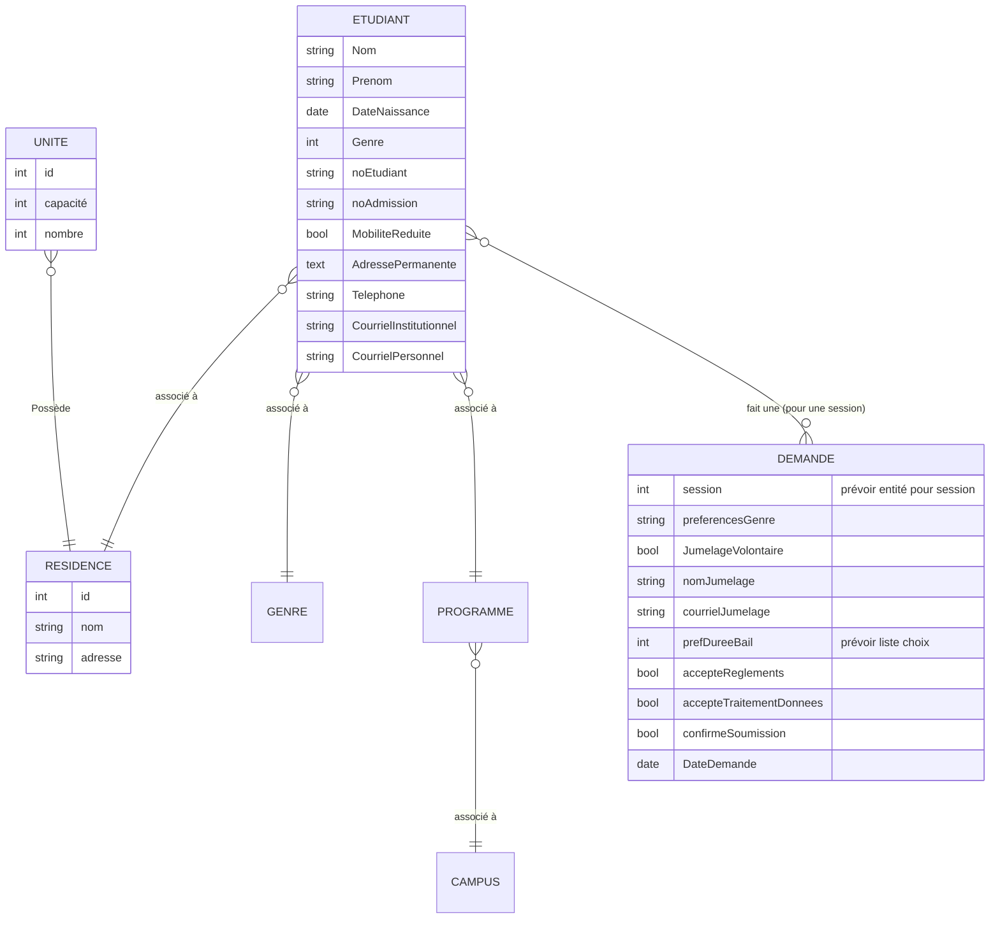

```mermaid
erDiagram

UNITE }o--|| RESIDENCE : Possède
ETUDIANT }o--|| RESIDENCE : "associé à"
ETUDIANT }o--|| GENRE : "associé à"
ETUDIANT }o--|| PROGRAMME : "associé à"
ETUDIANT }o--o{ DEMANDE : "fait une (pour une session)"
PROGRAMME }o--|| CAMPUS : "associé à"

RESIDENCE {
int id
string nom
string adresse
}

UNITE {
 int id
 int capacité
 int nombre    
}

ETUDIANT {
 string Nom 
 string Prenom 
 date DateNaissance 
 int Genre
 string noEtudiant
 string noAdmission
 bool MobiliteReduite 
 text AdressePermanente 
 string Telephone 
 string CourrielInstitutionnel 
 string CourrielPersonnel 
}

DEMANDE {
 int session "prévoir entité pour session"   
 string preferencesGenre
 bool JumelageVolontaire
 string nomJumelage
 string courrielJumelage
 int prefDureeBail "prévoir liste choix"
 bool accepteReglements
 bool accepteTraitementDonnees
 bool confirmeSoumission
 date DateDemande
}

```
